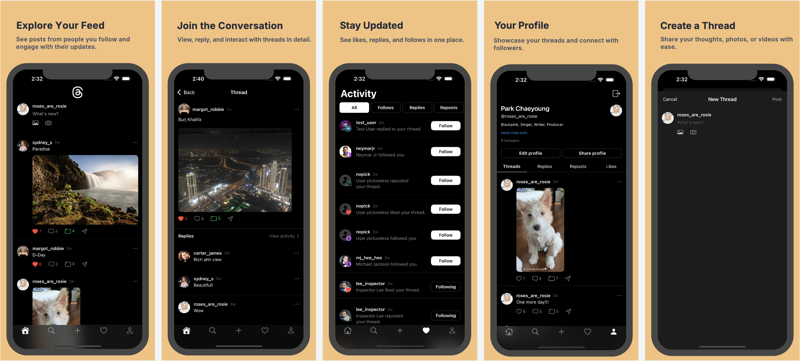

# Nexus iOS App

Nexus is an iOS social media application built using **Swift** and **SwiftUI**, inspired by platforms like Twitter and Threads. The app allows users to post updates, follow others, like and comment on posts, and receive real-time notifications. It integrates **Firebase** for backend services, including real-time data synchronization and user authentication.

---

## 📜 Table of Contents
- [Screenshots](#-screenshots)
- [Features](#-features)
- [Technologies Used](#-technologies-used)
- [Installation](#-installation)
- [Usage](#-usage)
- [Credits](#-credits)
- [License](#-license)

---

## 📷 Screenshots



---

## 🚀 Features
- Post text & image updates to share with followers.
- Follow other users and see their posts on the feed.
- Like and comment on posts to interact with content.
- Receive real-time notifications through **Firebase**.
- Manage your profile, including display name and profile picture.
- Dark & Light modes

---

## 🛠 Technologies Used
- **Swift** & **SwiftUI**: For building a modern, responsive user interface.
- **Firebase**: For backend services including:
  - **Firebase Authentication**: Manage user sign-in/sign-up.
  - **Firebase Firestore**: Real-time data storage for posts, comments, and user interactions.
  - **Firebase Storage**: Storing profile pictures and media.

---

## 📥 Installation

1. Clone the repository:
    ```bash
    git clone https://github.com/your-username/nexus-ios.git
    ```

2. Navigate to the project directory:
    ```bash
    cd nexus-ios
    ```

3. Open the project in Xcode:
    ```bash
    open Nexus.xcworkspace
    ```

4. Install project dependencies using **CocoaPods** (if applicable):
    ```bash
    pod install
    ```

5. Set up **Firebase**:
   - Create a Firebase project and add an iOS app.
   - Download the `GoogleService-Info.plist` from Firebase and add it to your project.
   - Enable **Firestore** and **Authentication** in the Firebase Console.

6. Build and run the project:
    ```bash
    cmd + R
    ```

---

## 💻 Usage
- Sign up or log in using Firebase Authentication.
- Post updates to your timeline, follow users, and interact with posts.
- Check notifications for real-time updates on likes, comments, and new followers.
- Access your profile to manage account details and upload a profile picture.

---


## 📄 License
This project is licensed under the MIT License - see the [LICENSE](LICENSE) file for details.

---

### 📬 Contact
For inquiries or feedback, feel free to reach out to me via GitHub or [your preferred contact method].
